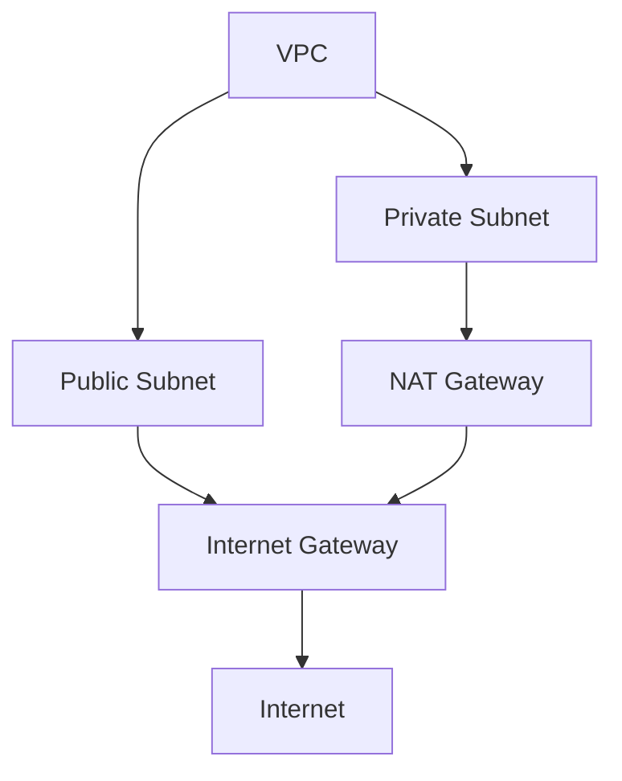

# AWS를 사용한다면 반드시 알아야 할 네트워크 기초 지식

[youtube aws 링크](https://youtu.be/vCNexbgYmQ8?si=u26sFZ7HrMx4xEgv)

## VPC 중심 네트워크 구성하기

### 1. Default VPC

**AWS 자원 레벨**

- 글로벌
- 리전 -> vpc 는 리전단위
- 가용영역 -> EC2, Amazon RDS

**VPC란?**

- AWS 내 사용자 전용 가상 네트워크
- 격리된 프라이빗 클라우드 환경 제공

**<특징>**

1. 네트워크 격리
   - 다른 VPC , AWS 계정 간 격리
2. 접근제어
   - NACL (Network Access Control List)
   - 보안 그룹 (Security Groups)
   - IAM 정책

어느 리전에서 실행하더라도 같은 디폴트 VPC 172.31.0.0/16 (local)
-> VPC 내부는 서로 통신이 가능한 상태

3. 네트워크의 흐름 제어를 위해 NACL 사용
   상태를 저장하지 않는

### 2. 보안강화된 네트워크 위한 VPC 설계 전략

### 3. Hybrid Networking
