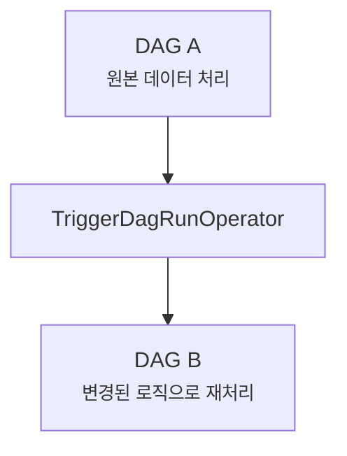
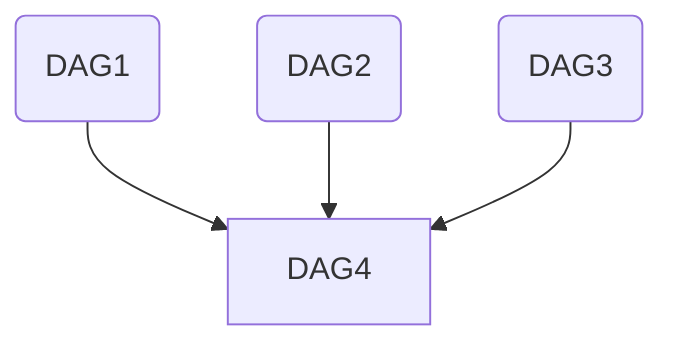

# Chapter 6. 워크플로 트리거

- 특정 조건을 센서에 만족하도록 대기
- 서로 다른 DAG의 태스크 간 의존석 설정
- CLI 및 REST API 를 통해 워크플로 설정

## 6.1 센서를 사용한 폴링 조건

#### 📝 문제 상황

새로운 데이터가 비정규적인 시간에 도착하는 경우:

> 기존 문제점
> 지정된 시간에 시작하도록 했을 때 데이터가 들어올 때까지의 대기시간이 많이 소요됨

#### ✨ 해결방안

Airflow 오퍼레이터의 특수타입 센서(sensor)를 사용

- 센서는 특정조건이 `true` 인지를 지속적으로 확인하고 `true` 라면 성공
- false인 경우, 상태가 `true`가 될때 까지, 타임아웃이 될때 까지 계속 확인

#### 💻 구현 예시

```python
from airflow.sensors.filesystem import FileSensor

wait_for_supermarket_1 = FileSensor(
    task_id="wait_for_supermarket_1"
    filepath="/data/supermarket1/data.csv"
)
```

- 파일 존재 여부 확인 (`true`/`false`)
- 센서도 오퍼레이터이므로 타임아웃 설정 가능
- 약 1분에 한 번씩 파일 확인 (`포킹/Poking`)
- `poke_interval` 인수로 간격 조정 가능
- `Task Log`에서 센서의 출력 내용 확인 가능
- DAG의 시작시간을 데이터가 도착하는 경계의 시작부분에 배치함

### 사용자 지정 조건 폴링

#### 📝 문제 상황

와일드 카드를 형식을 이용해 여러 파일을 처리하게 되면 원하진 않는 데이터에도 True 값을 반환할 수 있음

#### ✨ 해결방안

최종 업로드 파일은 \_SUCCESS 라는 접미사를 붙이기로 합의 하였음
-> PythonSensor를 그리고 Callable을 사용하여 구현

```python
from pathlib import Path
from airflow.sensors.python import PythonSensor

def _wait_for_supermarket(supermarket_id):
    supermarket_path = Path("/data/"+supermarket_id)
    data_files=supermarket_path.glob("data-*.csv")
    success_file=supermarket_path / "_SUCCESS"
    return data_files and success_file.exists()

wait_for_supermarket_1 = PythonSensor(
    task_id="wait_for_supermarket_1",
    python_callable=_wait_for_supermarket,
    op_kwargs={"supermarket_id":"supermarket1"}.
    dag=dag
)
```

### 원활하지 않는 흐름의 센서처리

#### 📝 문제 상황

만약 데이터가 더이상 제공되지 않는다면? <br>
다른 오퍼레이터들과 마찬가지로 실패할 것 (최대시간을 초과하는 센서이기 때문)  
보통센서의 타임아웃은 7일로 만약 DAG가 하루에 한번 실행된다면 점점 중첩되어 센서 데드록의 가능성

#### ✨ 해결방안

실행테스크 수의 제한

```python
Dag = DAG(
    Dag_id="couponing_app",
    Start_date=datetime(2019,1,1),
    Schedule_interval="0 0 * * *",
    Concurrency=50, #->동시에 50개의 태스크 실행을 허용
)
```

#### 📝 문제 상황

센서 데드록 : 위의 센서를 태스크 조건이 true가 될때 까지 다른 태스크가 대기하게 되므로 모든 슬롯이 데드록 상태가 됨

#### ✨ 해결방안

센서를 `poke` 또는 `reschedule` mode로 인수 설정가능 - `defualt: poke`
poke 모드 : 센서 태스크가 실행중인 동안 태스크 슬롯을 차지하여 최대 크기에 도달하면 차단  
reschedule 모드 : 포크 동작을 실행할때만 슬롯을 차지함

## 6.2 다른 DAG을 트리거 하기

앞에 여러개의 DAG 가 있고 그 모든 데이터를 사용할 수 있게 되었을때 실행하도록 하는 create_metrics 라는 태스크가 있을때 이는 분할 가능하다.  
태스크를 모두 복제 하고 더 많은 반복 태스크를 발생시킴

거의 비슷한 기능의 태스크 반복을 피하는 한가지 옵션은 각 DAG를 여러개의 작은 DAG로 분할하여 각 DAG가 일부 워크 플로를 처리하는 것  
장점 : 단일 DAG에서 여러 태스크를 보유하지 않고 DAG1이 DAG2를 여러번 호출 할 수 있음

```python
from pathlib import Path

import airflow.utils.dates
from airflow import DAG
from airflow.operators.dummy import DummyOperator
from airflow.operators.trigger_dagrun import TriggerDagRunOperator
from airflow.sensors.python import PythonSensor

dag1 = DAG(
    dag_id="listing_6_04_dag01",
    start_date=airflow.utils.dates.days_ago(3),
    schedule_interval="0 16 * * *",
)
dag2 = DAG(
    dag_id="listing_6_04_dag02",
    start_date=airflow.utils.dates.days_ago(3),
    schedule_interval=None,
)


def _wait_for_supermarket(supermarket_id_):
    supermarket_path = Path("/data/" + supermarket_id_)
    data_files = supermarket_path.glob("data-*.csv")
    success_file = supermarket_path / "_SUCCESS"
    return data_files and success_file.exists()


for supermarket_id in range(1, 5):
    wait = PythonSensor(
        task_id=f"wait_for_supermarket_{supermarket_id}",
        python_callable=_wait_for_supermarket,
        op_kwargs={"supermarket_id_": f"supermarket{supermarket_id}"},
        dag=dag1,
    )
    copy = DummyOperator(task_id=f"copy_to_raw_supermarket_{supermarket_id}", dag=dag1)
    process = DummyOperator(task_id=f"process_supermarket_{supermarket_id}", dag=dag1)
    trigger_create_metrics_dag = TriggerDagRunOperator(
        task_id=f"trigger_create_metrics_dag_supermarket_{supermarket_id}",
        trigger_dag_id="listing_6_04_dag02",
        dag=dag1,
    )
    wait >> copy >> process >> trigger_create_metrics_dag

compute_differences = DummyOperator(task_id="compute_differences", dag=dag2)
update_dashboard = DummyOperator(task_id="update_dashboard", dag=dag2)
notify_new_data = DummyOperator(task_id="notify_new_data", dag=dag2)
compute_differences >> update_dashboard
```

이때 TriggerDagRunOperator의 trigger_dag_id인수에 제공되는 문자열은 트리거할 DAG의 dag_id 와 일치해야함.  
-> 상세내역을 통해 트리거가 되었는지 안되었는지 확인이 가능함

schedule\_\_ : 스케줄되어 DAG 실행이 시작되었음을 나타냄  
backfill\_\_ : 백필 테스크에 의해 DAG 실행이 시작되었음을 나타냄  
manual\_\_ : 수동으로 DAG 실행이 시작되었음을 나타냄

### TriggerDagRunOperator로 백필 작업

일부 로직을 변경하고 변경된 부분부터 DAG를 다시 실행하려면?  
단일 DAG에서는 태스크의 상태를 삭제하면 됨
또 다른 DAG 안에서 TriggerDagRunOperator의 다운스트림 태스크는 지워지지 않고 새 DAG 실행을 트리거 함



### 다른 DAG의 상태를 폴링하기

여러 다운스트림 DAG을 트리거 하는 하나의 DAG의 TriggerDagRunOperator를 사용 가능



위와 같은 경우 DAG간의 의존성을 관리해야함

HOW? 다른 DAG에서 태스크 상태를 포크하는 센서인 `ExternalTaskSensor`를 적용

ExternalTaskSensor의 경우 정확히 동일한 실행 날짜를 가진 태스크에 대한 성공만 확인함  
 -> 스케줄 간격이 맞지 않는 경우 ExternalTaskSensor가 다른 태스크를 검색할 수 있도록 offset을 설정 가능함

- `external_dag_id`: 모니터링할 DAG ID
- `external_task_id`: 모니터링할 태스크 ID
- `allowed_states`: 허용되는 태스크 상태
- `execution_delta`: 실행 시점 차이
- `timeout`: 최대 대기 시간

## REST/CLI를 통해 워크플로 시작하기

Airflow CLI를 사용하여 DAG를 트리거 할때 외부에서 트리거 되엇음을 알리는 `__manual` 표시

```cli
airflow dags trigger dag1
airflow dags trigger -c '{"supermarket_id":1}' dag1
```

REST API를 사용하여 트리거 하여도 동일한 결과를 얻을 수 있음
