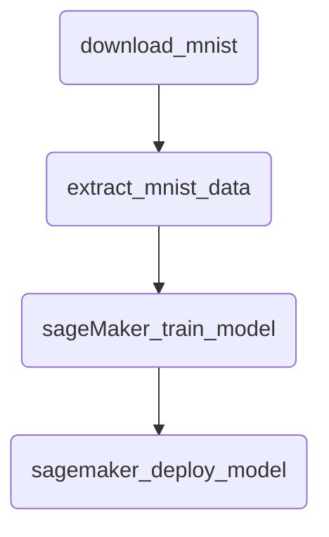

# Chapter 7. 외부 시스템과 통신하기

- Airflow 오퍼레이터로 Airflow 외부의 시스템에서 태스크를 수행
- 외부 시스템에 특화된 오퍼레이터 적용
- Airflow 오퍼레이터를 구현하여 A to B 작업을 수행하기
- 외부 시스템에 연결하는 태스크 테스트 하기

에어플로우는 구페적인 목적을 위한 오퍼레이터 또 한 존재함

외부시스템 : storage, Apache Spark, BigQuery와 같은 외부 시스템

## 7.1 클라우드 서비스에 연결하기

많은 클라우드 서비스는 공급자가 제공하는 API 를 통해 제어 가능

- AWS : boto3
- GCP : Cloud SDK
- Azure : Azure SDK for Python

Airflow에서 프로그래머에 제공되는 인터페이스는 `오퍼레이터`로 이 내부적으로 클라우드의 SDK를 사용해 요청을 보내고 그 기능을 제공하는 레이어를 제공함

### 추가 의존성 패키지 설치

ex. S3CopyObjectOperator 는 특정 버킷의 오브젝트를 다른 곳으로 복사

### 머신러닝 모델 개발하기

모델을 학습시켰다. 그 이후 입력되지 않은 손으로 쓴 새로운 번호를 입력할 수 있고 모델은 번호를 분류할 수 있어야 함.

- 오프라인부분: 세트 분류와 학습, 결과가 저장 -> 새로운 데이터가 들어올때 마다 주기적으로 시행가능 -
  - Airflow 워크플로는 일반적으로 오프라인 부분을 담당
  - 모델 학습 과정 : 데이터 로드 -> 전처리 -> 학습 (배치 프로세스)
- 온라인 부분 : 모델을 로드하고 이전에 학습하지 않앗던 데이터를 숫자로 분류하는 역할
  - 직접적인 API 호출 또는 HTML 내에서 REST API호출을 포함하는 웹페이지

<center>



</center>

\*\*sagemaker :  
AWS에서 제공하는 완전 관리형 머신러닝 서비스  
데이터 준비부터 모델 배포까지 전체 ML 워크플로우 지원

### 외부 시스템을 이용하여 개발하기

[아파치 에어플로우 실습 링크](https://github.com/K9Ns/data-pipelines-with-apache-airflow)

AWS의 경우 엑세스키를 사용해 사용자의 개발 시스템에서 클라우드 리소스를 액세스 가능하기 때문에 로컬에서 airflow 태스크를 실행 가능함

파일이름을 날짜로 지정했다면 날짜를 기준으로 백필을 하거나 실행해야 하므로 주의해야함!

- `AWS_PROFILE` : boto3가 클라이언트 인증을 위해 사용하는 환경변수 설정
- `AWS_HOME` : Airflow의 로그 등을 저장하는 위치 (= `AIRFLOW__CORE__DAGS_FOLDER`)
- `AIRFLOW__CORE__SQL_ALCHEMY_CONN` : 모든 상태를 저장하기 위한 데이터베이스의 URI

SageMaker KMeans 모델의 입력형식인 RecordIO 포맷으로 변환하는 형식도 추가  
-> 데이터가 태스크 실행이 완료되면 데이터가 S3에 변환된 파일이 표시됨

## 7.2 시스템간 데이터 이동하기

- Airflow의 일반적인 사용 사례: `ETL`
- 프로덕션 데이터베이슨느 대부분 과거 이력데이터를 반환할 수 없음. 따라서 주기적으로 데이터를 내보내고 저장해 나중에 처리할 수 있도록 함
- 기존 데이터 덤프에 필요한 스토리지 저장공간은 빠르게 증가하게 되고 모든 데이터를 처리하기 위해서 분산처리가 필요함.

어떻게 Airflow로 오케스트레이션을 할것인가?
MySQ 데이터 베이스를 쿼리하여 그 결과를 S3로 복사하거나 REST API를 호출해 출력을 저장함

MongoToS3Operator를 구현

```Python
def execute(self, context):
    s3_conn = S3Hook(self.s3_conn_id) #s3의 인스턴스 객체 생성

    result = MongoHook(self.mongo_conn_id).find(
        mongo_collection=self.mongo_collection,
        query-self.mongo_query,
        mongo_db=self.mongo_db
    )

    doc_str = self._stringify(self.transform(results))

    s3_conn.load_string(
        string_data=docs_str,
        key=self.s3_key
        bucket_name=self.s3_bucket,
        replace=self.replcae
    )
```

주의해야할 점 : Airflow가 동작하는 시스템의 파일 시스템을 사용하지 않고 모든 결과를 메모리에 보관하고 있음. 쿼리 결과의 크기에 따라 Airflow 시스템에서 사용 가능한 메모리가 부족해질 수 있음

데이터 파이프라인 개발 시에 자주 발생하는 어려운 부분은 다양한 작업의 조각들을 올바르게 구성되도록 서로 잘 맞춰야 하는 것  
튜플리스트를 CSV 로 통일하여 판다스나 스파크에서 쉽게 사용할 수 있도록 하기

#### 큰 작업을 외부에서 수행하기

- 에어플로우는 어떻게 사용되어야 할까?

  1. 에어플로우 자체에서 태스크 실행을 하도록 하는 시스템
  2. 에어플로우는 태스크 트리거 시스템으로만 사용하고 Spark 와 같은 데이터 처리 시스템에서 실제 작업을 수행학시

- Spark 인스턴스를 Airflow 에서 찾기 위해서는 `spark-submit` 파일과 `YARN` 클라이언트구성이 필요하고 `SparkSubmintOperator`를 사용함
- SSHOperator 사용 : ssh 엑세스가 필요함
- `SimpleHTTTPOperator`: Apache spark 용 Rest API 인 Livy를 실행해야 함
- `DockerOperaotr` : 이를 이용해 도커 컨테이너를 시작하게 할 수 있음  
   -> 호스트 컴퓨터의 다른 서비스에 연결하려면 호스트 네트워크 모드를 사용하며 호스트 네트워크 네임 스페이스를 공유해야함

결론 :  
Airflow 는 컨테이너의 시작, 로그 가져오기, 필요한 경우 삭제를 관리함  
중요한 점은 멱등성을 유지하고 불필요한 찌꺼기 남지 않도록 보장해야 한다는 점
