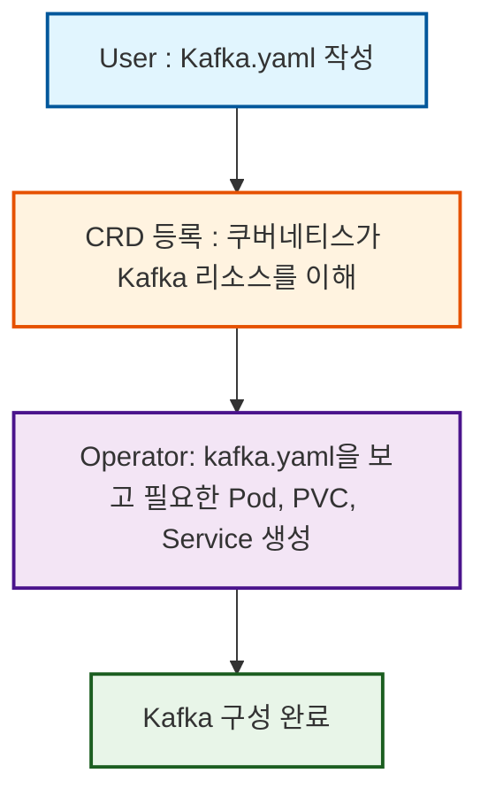

# 카프카 리서치

## [pre] 미니쿠베의 설치

1. 도커 설치
2. kubectl 설치 </br>
   `brew install kubectl`
3. minikube 설치 </br>
   `brew install minikube`
4. `minkube start`를 진행하면 자동으로 도커에 미니쿠베 이미지를 가져와 컨테이너 실행함

## 1. Helm을 이용한 카프카 배포

### Helm이란? </br>

- 쿠버네티스 패키지 매니저
- `pip` 이나 `npm` 과 같이 비슷한 툴이라고 할 수 있음
- [Helm 공식 문서](https://helm.sh/docs/intro/install/)
- `brew install helm`

### 시작방법

1. bitnami의 설치

   - bitnami 내의 카프카를 사용가능
   - ['Artifact Hub' 의 카프카 'Helm Chart'](https://artifacthub.io/packages/search?ts_query_web=kafka&sort=relevance&page=1)
   - `helm repo add bitnami https://charts.bitnami.com/bitnami`
   - `helm repo update`

2. 카프카 서버 설치

   - kafka와 Zookeeper를 동시에 설치됨
   - `helm install my-kafka[helm의 릴리즈 이름(변경가능)] bitnami/kafka`

   - 쿠버네티스 리소스 자동 생성 `helm install`
     - StatefulSet (Kafka 브로커 Pod 1개 이상)
     - Service (ClusterIP) — 내부 통신용
     - Headless Service — 브로커 간 통신용
     - Secrets, ConfigMap 등 부가 리소스
     - 필요시 PVC (Persistent Volume Claim)

3. 카프카의 접속 (카프카 클라이언트의 설치)

   - 카프카 클라이언트의 설치 후에 클러스터 내부에서 접근
   - `kubectl run kafka-client --restart='Never' --image docker.io/bitnami/kafka:latest --namespace default --command -- sleep infinity`
   - `kubectl exec -it kafka-client -- bash`

   - 사용방법

     ```bash
     # 토픽 생성
     kafka-topics.sh --create --topic test --bootstrap-server my-kafka:9092 --replication-factor 1 --partitions 1

     # 메시지 전송
     kafka-console-producer.sh --topic test --bootstrap-server my-kafka:9092

     # 메시지 수신 (새 터미널에서)
     kafka-console-consumer.sh --topic test --from-beginning --bootstrap-server my-kafka:9092
     ```

4. SASL 인증 사용 중인 경우 client.properties 를 생성해보기

   - client.properites 생성

     ```
     #client.properties

     security.protocol=SASL_PLAINTEXT
     sasl.mechanism=SCRAM-SHA-256
     sasl.jaas.config=org.apache.kafka.common.security.scram.ScramLoginModule required \
     username="user1" \
     password="여기에_실제_비밀번호";
     ```

   - 실제 비밀번호 찾기 :</br>
     `kubectl get secret kafka-user-passwords --namespace default -o jsonpath='{.data.client-passwords}' | base64 -d | cut -d , -f 1`

   - 클라이언트 설정 파일을 pod에 복사 </br>
     `kubectl cp ./client.properties kafka-client:/tmp/client.properties --namespace default`

## 2. yaml 파일과 strimzi operator를 이용한 카프카 설치

### Operator 란?

pre-defined 리소스 이외에 <span style = 'background-color : #f5dd7f;'>새로운 리소스(CR)를 정의해서 사용할 수 있고 이를 관리하는 관리자</span>로 `controller` 혹은 `operator`라고 함

쿠버네티스의 `컨트롤 루프`를 그대로 사용하기 때문에 사용자 정의 상태를 감시하고 계속 조절함

특정 앱, 데이터베이스와 같은 상태를 가지는 stateful application 같은 경우에는 백업, 복구, 데이터 마이그레이션 등 많은 상태를 관리해야함.

모든 앱들은 이런 상태들 지식이 다름. 이를 사용자 정의 리소스(어떤 운영지식 이던지)를 코드로 만들어 쿠버네티스가 관리하도록 함

### CRD(Custom Resource Definition) 란?

쿠버네티스는 기본적으로 `Pod`, `Service`, `Deployment` 같은 리소스만 알고 있음

직접 정의한 리소스 (Custom Resource) 를 사용하고 싶을 때 `yaml` 파일로 `Definition`을 정의. 이 파일을 CRD 파일이라고 함.

<span style = 'background-color : #f5dd7f;'> 즉, CRD = 쿠버네티스에게 새로운 리소스를 알려주는 사전 등록 절차 </span>

<div align="center" style="width: 40%;  margin: 0 auto;">



</div>

### 카프카 구성

1. Strimzi Operator 설치

   Zookeeper, Kafka 클러스터와 토픽에 대한 관리까지 구성 가능

   

   ```
   kubectl create namespace kafka

   kubectl apply -f https://strimzi.io/install/latest?namespace=kafka -n kafka
   ```

2. Kraft Mode yaml 파일 (by. 창렬님)

   - KafkaNodePool : Kafka 브로커와 컨트롤러를 더 세분화해서 구성·운영할 수 있게 해주는 리소스(Custom Resource)

     - 브로커
     - 컨트롤러

   - Kafka : 카프카 클러스터

     - 각 노드가 브로커와 컨트롤러 역할 수행
     - 복제 및 가용성 설정
     - 관리자 설정

   - [strimzi doc : kraft 모드 배포](https://strimzi.io/docs/operators/latest/deploying#deploying-kafka-cluster-kraft-str)

   - 실행방법
     1. 실행 - `kubectl apply -f kafka-cluster.yaml -n kafka`
     2. 실행 후 서비스 확인 - `kubectl get svc -n kafka`
     3. 카프카 토픽을 배포 - `kubectl apply -f kafka-topic.yaml -n kafka`
     4. 카프카 토픽 배포 확인 - `kubectl get kafkatopic -n kafka`
     5. 카프카 프로듀서 실행 - `kubectl -n kafka run kafka-producer -ti --image=quay.io/strimzi/kafka:0.46.1-kafka-3.9.0 --rm=true --restart=Never -- bin/kafka-console-producer.sh --bootstrap-server trade-cluster-kafka-bootstrap:9092 --topic my-topic{카프카토픽으로 배포된 이름}`
     6. 카프카 컨슈머 (새 터미널에서 실행) - `kubectl -n kafka run kafka-consumer -ti --image=quay.io/strimzi/kafka:0.46.1-kafka-3.9.0 --rm=true --restart=Never -- bin/kafka-console-consumer.sh --bootstrap-server trade-cluster-kafka-bootstrap:9092 --topic my-topic --from-beginning`
